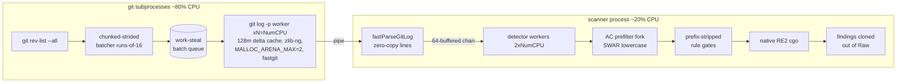
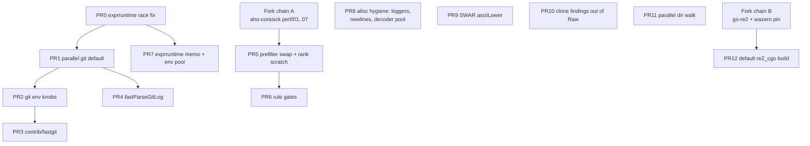

# betterleaks perf branch vs stock main — stacked-PR review & tracking doc

> **Status:** living document. Tracks the decomposition of `perf/logmode-integration`
> (35 commits + 2 dependency forks) into a chain of stacked PRs, the first-principles
> rationale and measurements behind every change, and the test gaps that must close
> before each PR merges.
>
> - Branch under review: `perf/logmode-integration` @ `7b0127b` (this repo)
> - Baseline: stock `main` @ `872e374` (checkout at `/tmp/bl-stock`)
> - Experiment ledger: `/home/ahrav/scratch/betterleaks/autoresearch-results.tsv` (90 rows)
> - Fork A: aho-corasick — `/local/home/ahrav/scratch/aho-integration` @ `perf/integration` (`22faf6b`)
> - Fork B: go-re2 — `/local/home/ahrav/scratch/go-re2-integration` @ `perf/integration` (`2846532`),
>   pinned wazero `ahrav/wazero@48fbe11a`
> - Measurement harness: `scripts/benchcpu2.sh` (getrusage-children CPU + cgroup memory.peak + load gate)

---

## 0. The 30,000-foot view

**The problem.** Stock betterleaks (`/tmp/bl-stock` @ `872e374`) scans a git repo
**by default** with one `git log -p -U0` process. Parallel scanning already exists in
stock — `ParallelGit` behind the opt-in `--git-workers N` flag (stock
`cmd/git.go:31,99–109`) — but it is off by default, partitions commits into **static
contiguous chunks** (`chunkSize = ceil(count/workers)`, one chunk per worker,
`sources/parallel_git.go:65–79`), caps the library-auto worker count at
`min(NumCPU, 4)` (`:36–41`), and hard-errors when `git rev-list` rejects the
log-opts. Either way, output goes through the general-purpose `gitdiff.Parse` and a
detector whose hot loop allocates heavily (maps, loggers, matches, decoder state).

So there are **two honest baselines**, and this doc uses both:

- **B-default** — stock with default flags (single git process): full gitlab-foss
  scan (117k commits, 4.19 GB of history) = **16m21s**.
- **B-parallel** — stock's opt-in `--git-workers` path (static contiguous chunks,
  wazero regex engine, same worker count granted): 20k-commit slice = **109 s at
  ~516% CPU** (TSV rows 5/5b, the "static/wazero" baseline). Static chunks leave most
  cores idle behind stragglers — ~5 of 16 workers busy on average.

Profiling showed two separate regimes:

- **git-bound**: ~80% of total CPU is inside `git log -p` subprocesses (TSV `inv2`:
  git 1220 of 1530 core-s). Wall clock = arrival time of the last fragment; the
  detector has *zero* tail (`inv9`).
- **detector-bound** (dir scans, self-scans): aho-corasick prefilter ~18%, regex engine
  ~16%, codec ~6–10%, GC ~15%, lowercasing ~2–3% (`inv8`).

**Headline results** (hard guard on every keep: **byte-identical findings** — digest
`faee6b5c`/4703 findings on gitlab-foss):

| Benchmark | Baseline | Final | Speedup |
|---|---|---|---|
| self-repo wall (default flags) | 3.66 s | 0.93 s | **3.9×** |
| gitlab-foss wall (default flags, B-default) | 16m21s | 55.4 s (stock git) / **46.4 s** (fastgit) | **17.7× / 21×** |
| 20k-commit slice wall (vs B-parallel, stock `--git-workers`) | 109 s @ 516% CPU | 21.8–23.2 s | **~5×** |
| gitlab-foss CPU (core-s, benchcpu2 like-for-like) | 1518 | 1126 (with fastgit) | **−25.8%** |
| dir scan (70k files) wall | 2.15 s | 1.53 s | −29% |
| detector RSS | 384 MB | 345 MB | −10% |

> **Caveat on the 5× row:** the 109 s B-parallel measurement was taken on the stock
> **wazero** regex build (stock's default engine), and the 23.2 s figure includes the
> cgo engine swap (PR12) and more workers — the ledger never isolated
> batching-alone at matched engine + worker count on this slice. (The often-quoted
> "CPU 516%→1829%" utilization jump is from the earlier round-robin iteration, TSV
> row 5 — the 21.8–23.2 s runs record no CPU%.) The clean attribution that *is*
> isolated: contiguous vs strided batching at matched everything-else = **−28% git
> CPU for contiguous but +93% wall** (`inv4`: 843 vs 1180 core-s, 112 s vs 58 s) —
> static/contiguous partitioning is a wall-clock disaster and a CPU win, which is
> exactly the tension PR1's design resolves.
>
> **Caveats on baselines:** wall figures come from two harnesses across sessions —
> 55.4 s is a session-1 hyperfine number, 46.4 s is the FINAL2 quiet-box run; the
> CPU row uses the like-for-like benchcpu2 baseline (1518.09, session-3 `0-v4`) —
> the session-2 figure (1530.8) was taken with a different harness. The dir-scan
> baseline is the ledger keep-pair (2.15→1.53, rows 3/3b); an earlier investigation
> run measured 2.19 s (`inv7`).

**Methodology.** Every change measured against the previous keep on fixed corpora
(self / prometheus "med" / gitlab-foss "large"): `hyperfine` for wall (session 1),
`benchcpu2.sh` for CPU-primary sessions — `getrusage(RUSAGE_CHILDREN)` for
whole-process-tree CPU, transient systemd cgroup `memory.peak` for whole-tree RSS,
load gate to reject contaminated runs. Every keep required an identical findings
digest. Discards are as instructive as keeps and are recorded per-PR below.

**Pipeline after the changes:**



---

## 1. The stacked-PR chain

The 35 commits decompose into **12 scanner PRs + 2 dependency fork chains**.



### PR tracking checklist

| PR | Title | Commits | Blocking test work | Status |
|---|---|---|---|---|
| PR0 | exprruntime data-race fix | `152a1da` | race regression test (§4 gap 4a) | ☐ |
| PR1 | Parallel git source by default | `f1250c1` `4948dba` `c22e96a` `a14e095` `dc0eb3c` `795b0ac` | batch-construction property test (§4 gap 2) — **blocking** | ☐ |
| PR2 | Git subprocess env tuning | `7679d3d` `ce0605c` `13e8f7c` `6b2a903` | env table tests (§4 gap 6) | ☐ |
| PR3 | contrib/fastgit build recipe + xdiff patch | `2cea82c` | parity docs; optional corpus hook | ☐ |
| PR4 | fastParseGitLog streaming parser | `bc6480a` | fuzz target (§4 gap 7) | ☐ |
| PR5 | Prefilter swap + rank scratch + semgroup | `4461b30` `0dacba4`→`9fbadf2`(revert)→`1613b82` `8bf9949` `5b265da` | depends fork A publish; Walk benchmark (§4 gap 11) | ☐ |
| PR6 | Prefix-stripped rule gates | `2518da8` | soundness property test (§4 gap 1) — **blocking** | ☐ |
| PR7 | exprruntime memo + pooled env maps | `156f350` `414be1d` | memo len-guard + pooled-env tests (§4 gap 4b/4c) | ☐ |
| PR8 | Detector alloc hygiene | `169127e` `730dee5` `5d8db14` `252f632` | decoder-pool clear test (§4 gap 5) | ☐ |
| PR9 | SWAR asciiLower | `670ccd0` | done (exhaustive test ships with it) | ☐ |
| PR10 | Clone findings out of fragment.Raw | `9c8528e` | — | ☐ |
| PR11 | Parallel directory walk | `ab04faf` (incl. root-handling fix, ledger rows 3/3b) | WalkDir-equivalence + -race tests (§4 gap 3) | ☐ |
| PR12 | Default build = native RE2 (cgo) | `bb503d6` | — | ☐ |
| Fork A | aho-corasick perf/01..07 | (already stacked) | merge fuzz harness; Decode value validation (§4 gaps 9/10) | ☐ |
| Fork B | go-re2 + wazero pin | (see §3) | **F1–F4 must be fixed first** | ☐ blocked |

---

### PR0 — exprruntime data-race fix (`152a1da`) — correctness, must land first

**The bug (present in stock main).** `Program.evalBindings()` did a *shallow* clone of
the bindings map, then wrote `rt.tokenizer = prg.tokenizer` — but `b["__runtime"]` in
the clone still points at the **one shared** `*runtimeBindings` struct. Every concurrent
`EvalFilter`/`EvalPrefilter` (stock runs 40 detector goroutines) raced on that write.
The race detector reported 15 warnings; in high-concurrency pack-mode it produced
**nondeterministic findings** (11922/11923/11924 across runs, TSV `inv16`). Dir mode
has the same race, just narrower windows.

**The fix** (`internal/exprruntime/runtime.go:163–170`): resolve tokenizer wiring
**once at compile time** — each compiled program gets a private cloned
`runtimeBindings`, written before the program is published to callers, so the
write is safe — and make `failsTokenEfficiency` (`bindings_filter.go:172–187`)
read the provider without caching back into the shared struct (the provider
memoizes internally via `sync.Once`, so skipping the local cache costs one
indirect call).

**Measurement:** perf-neutral; findings digest became *stable* across runs. The pre-fix
pack digest was race-corrupted — "your baseline was wrong" class of find.

---

### PR1 — Parallel git scanning by default, with work-stealing chunked-strided batches

Files: `cmd/git.go:96–108`, `sources/parallel_git.go:33–124`.

**What stock already had:** `ParallelGit` exists in stock behind the opt-in
`--git-workers N` flag (stock `cmd/git.go:31,99–109`): commits enumerated once via
`git rev-list`, then split into **static contiguous chunks**, one chunk per worker
(`chunkSize = ceil(count/workers)`, stock `parallel_git.go:65–79`), library auto =
`min(NumCPU, 4)`, and a hard error if `rev-list` rejects the log-opts. Default
(flag=0) is a single git process.

**What this PR changes** (each independently measured):

1. **Default-on** (`f1250c1`): `ParallelGit` becomes the default source; the flag now
   means "override worker count" (`0 = auto`).
2. **Auto worker count → NumCPU** (`c22e96a`, via min(NumCPU,16) first): 20k slice
   35.3→23.2 s at 32 workers.
3. **rev-list fallback** (`parallel_git.go:46–52`): enumeration failure (e.g. `-n 5`
   with no ref — valid for `git log`, invalid for `rev-list`) now falls back to the
   single-process path instead of stock-parallel's hard error. Required for
   default-on to be safe with arbitrary `--log-opts`.
4. **Batch shape**: static contiguous chunks → work-stealing chunked-strided batches.
   This is where the interesting engineering is; iterations below.

| Iteration | Shape | Result |
|---|---|---|
| stock opt-in: static contiguous chunks | `commits[i*chunk:(i+1)*chunk]`, one per worker | 20k slice: 109 s @ ~516% CPU (stragglers idle most cores) |
| round-robin dealing (`4948dba`) | commit *i* → worker *i mod N* | 20k slice 109→36 s, CPU 516%→1829% (with the concurrent engine swap — see caveat in §0) |
| workers = NumCPU (`c22e96a`) | was min(NumCPU,16) | 20k slice 35.3→23.2 s |
| dynamic work-stealing (`a14e095`) | shared `chan []string` queue | 22.8→21.8 s, user CPU −8% |
| strided batches (`dc0eb3c`) | batch *b* gets commits *b, b+B, b+2B…* | full corpus 2m36s→**57.8 s** (890%→2745% CPU) |
| **chunked-strided runs of 16** (`795b0ac`) | 16-commit contiguous runs, dealt round-robin | git-only CPU −8% (probe), RSS −33%, wall +2 s (36→38 s probe) |

**First principles — why batch shape matters.** Two physical effects fight:

1. **Load balance.** Commit diff sizes are heavily skewed with the heaviest commits
   *clustered* in contiguous stretches of history (vendored-dep updates, generated
   churn). A contiguous 1/N slice can contain a whole cluster → one git process runs
   far longer than its peers and the scan waits for it. Measured on this corpus:
   batch-duration skew min 2.35 s / p50 4.79 / p99 13.6 / max 15.73 s (`inv10`), and
   contiguous batching cut CPU −5.6% but cost **wall +13%** (TSV v2 row 1 —
   discarded). Striding samples heavy regions uniformly.

2. **Delta-base cache locality.** Git stores blobs in packfiles as *delta chains*
   (object = base + delta ops). Materializing a blob at the end of a chain requires
   inflating the base and applying deltas; git caches materialized bases in the
   **delta-base cache** (`core.deltaBaseCacheLimit`, default 96 MiB). Commit N's
   post-image blobs *are* commit N+1's pre-image blobs, so a git process walking
   *consecutive* commits gets strong cache reuse. Walking commits 257 apart (pure
   striding) re-inflates chains from scratch. Measured directly: strided git CPU 1180
   core-s vs contiguous 843 (**−28%**, `inv4`) — but contiguous wall 112 s vs 58 s.

**Resolution:** runs of 16 consecutive commits dealt round-robin across batches
(`parallel_git.go:69–104`) — a run of 16 amortizes chain re-inflation ~16× while
keeping uniform sampling. Measured: git-only CPU −8% (probe matrix); whole-app
B-med −9.7% with fastgit / −8.5% with stock git (TSV row 19); **RSS −33%** (740 vs
1109 MB —
fewer cold re-inflations → fewer transient buffers), wall +1–2 s. After this landed
the delta-cache size sweep flattened (96m/128m/256m ≈ equal, TSV `19b`): locality
batching *subsumed* the cache-size knob.

**Sizing:** `batchSize = max(count/(workers*8), 64)` — 8 batches/worker gives the
work-stealing queue granularity to absorb residual skew. `inv11` swept
div8/16/32/64; div8 strictly best (finer = more git startups + worse locality:
44.1 s/1219 cpu → 56.8 s/1558 cpu at div64). `inv10`: residual imbalance only 9%
above the ideal-balance floor.

**Rejected:** contiguous count-aware batching (CPU win, wall loss ×2). TSV v2 rows 1–2
establish that **CPU and wall are in tension** on this architecture: steady fragment
arrival keeps the detector fed; bursty arrival from big caches / contiguous batches
stalls the pipe.

---

### PR2 — Git subprocess environment tuning

Files: `sources/git.go:37–126`.

Four knobs injected via environment so every git **scan** subprocess
(log/diff/rev-list/cat-file) inherits them without touching call sites (the one
non-scan git call, `ls-remote` in `getRemoteUrl`, gets the isolation env but is
not routed through `gitBinary()` — `sources/git.go:624`):

**(a) `core.deltaBaseCacheLimit=128m`** via `GIT_CONFIG_COUNT/KEY_0/VALUE_0`
(`git.go:88–92`) — git's config-by-env mechanism (git ≥ 2.31, `git-config(1)`),
equivalent to `-c` but inherited. Per git docs, deltaBaseCacheLimit is the
**per-thread** byte budget "for caching base objects that may be referenced by
multiple deltified objects". The default 96 MiB thrashes gitlab-foss's long delta
chains. (Commit `7679d3d` claims `git log -p` was "40% faster" at 512m vs the
default on gitlab-foss — commit-message provenance only, and measured for 512m,
not 128m; the 96 MiB default itself was never re-measured in the ledger.) Sweep
(`inv3`, git-only CPU):

| cache | git-only CPU (core-s) | note |
|---|---|---|
| 96m (default) | not in sweep | asserted-thrash baseline (see provenance note above) |
| **128m** | 1219 | **kept** |
| 512m | 1180 | −3% CPU but **wall +9%** and 2× aggregate RSS — rejected (tried twice: `7679d3d` → reduced by `ce0605c`) |
| 2g | 1350 | sys time explodes (page-cache pressure) |

**(b) `BETTERLEAKS_GIT_ZLIB` → LD_PRELOAD of zlib-ng** (`git.go:94–103`, opt-in).
Git history CPU is inflate-dominated (18.2% of git CPU, `inv26`). zlib-ng
(`ZLIB_COMPAT=ON`) is ABI-compatible with libz with NEON/AVX2-vectorized inflate
(chunked 16-byte copies via `uint8x16_t`, vectorized adler32 — the checksum zlib
streams actually use — plus CRC folding for gzip paths). **Byte-identical by
construction:** DEFLATE *de*compression is exact per spec (RFC 1951) — any
conforming inflater yields identical plaintext; only compression has degrees of
freedom and scanning never recompresses. Verified anyway (sha256 of diff streams +
findings digest). Preloaded **only** into git subprocess envs, never the scanner
(`setEnvVar`, `git.go:116–125`).
Measured: **B-large CPU 1518→1328 (−12.5%), wall 66.5→51.5 s; B-med −16%** — biggest
single log-mode win of session 3.

**(c) `MALLOC_ARENA_MAX=2`** (`git.go:109–111`, only when caller hasn't set it).
glibc malloc grows up to 8×cores arenas in threaded processes (64-bit; glibc
manual, `mallopt(3)` M_ARENA_MAX); each arena keeps its own free lists and grows
independently — multiplied across 32 parallel git processes that's idle heap +
page-fault churn. Git is effectively single-threaded here; 2 arenas lose nothing.
Measured: −1% CPU; primarily RSS control.

**(d) `BETTERLEAKS_GIT_BIN`** (`git.go:41–50`): route all git scan invocations
through an alternative binary when the env var points at one that exists
(stat-checked); fails safe to `git` from PATH. This is the hook PR3 plugs into.

**Rejected here:** jemalloc preload (−1.6% CPU, **+26% RSS** — per-proc arenas × 32
workers, `inv22`); `git commit-graph write` (−1%, contaminates corpus, `inv21`);
`F_SETPIPE_SZ` 1 MB pipes (wall −5%, sys flat — not adopted, `inv27`).

---

### PR3 — `contrib/fastgit`: scan-optimized git build (`2cea82c`)

Files: `contrib/fastgit/README.md`, `contrib/fastgit/xdiff-xxh3.patch`. Nothing in the
scanner binary changes; rides the PR2 `BETTERLEAKS_GIT_BIN` knob.

Motivating profile (`inv26`, custom git with symbols, whole-history `log -p`):

```
xdl_prepare_ctx   36.2%   ← xdiff PREPARATION (line hashing + classification)
inflate           18.2%   ← zlib (14.2% already NEON via zlib-ng)
xdl_recs_cmp       8.9%
memcmp             3.4%
stdio fputs/fwrite 4.6%
malloc             2.7%
```

The whale is not compression — it's `xdl_prepare_ctx`, specifically
`xdl_hash_record`: git hashes **every line of both blob versions** of every diff
with DJB2 (the XOR variant, `ha*33 ^ c`):

```c
for (; ptr < top && *ptr != '\n'; ptr++) {
    ha += (ha << 5);          /* ha = ha*33 */
    ha ^= (unsigned long) *ptr;
}
```

A 2-ops-per-byte **serial dependency chain** (each iteration needs the previous
`ha`) that also does the newline scan byte-at-a-time. The chain caps throughput at
~1 byte/cycle regardless of CPU width — measured on the target Graviton it runs at
~0.87 GB/s ≈ 0.33 B/cycle (the `add`+`eor` chain is ~3 cycles/byte on Neoverse).

**The patch** (`xdiff/xutils.c`) splits and vectorizes both jobs:
1. `memchr(ptr, '\n', top-ptr)` — libc's hand-vectorized (NEON) scan processes
   16–64 B **per loop iteration**; measured ~24.6 GB/s ≈ ~10 B/cycle L1-resident on
   the target Neoverse V1 — an order of magnitude over the scalar scan.
2. `XXH3_64bits(ptr, len)` — SIMD-width hashing (xxHash's published numbers are
   ~31 GB/s on modern x86 SSE2; lower on NEON but still ~10–30 GB/s class, vs the
   measured ~0.87 GB/s for the DJB2 loop).

**Why output cannot change** (the load-bearing argument, verified against the git
v2.50.1 source): in xdiff the line hash is *only a hash-table bucketing key* in
`xdl_classify_record` (`xprepare.c:117–121` requires `rcrec->ha == rec->ha &&
xdl_recmatch(...)` — **content equality** — and then overwrites `rec->ha` with the
canonical class index at `xprepare.c:142`); all downstream diffing
(patience/histogram/xdiffi) compares those class indices, never raw hashes. Any
deterministic hash function therefore produces byte-identical diffs; collisions
only cost time. The whitespace-flags path (where hash and recmatch must agree on
whitespace-insensitive equality) is deliberately left untouched by the patch.
Verified empirically: `cmp`-clean on 2k-commit (prometheus) and 5k-commit
(gitlab-foss, incl. root, merges, renames, unicode paths) streams + full
findings-digest parity.

Full build stack:

| Layer | Change | git CPU | Provenance |
|---|---|---|---|
| compiler | `-O3 -flto=auto` (distro is `-O2`, no LTO — LTO inlines across zlib/xdiff TU boundaries) | −5% | ledger `inv27` |
| zlib | *statically linked* zlib-ng compat (no LD_PRELOAD needed) | −12% | ledger `inv27` |
| PGO | `-fprofile-generate` → whole-history `log -p -U0` run → `-fprofile-use` (branch layout, hot/cold splitting) | −1% | ledger `inv27` |
| xdiff | XXH3+memchr patch | −15% | README/commit only (`2cea82c`); ledger `inv27` stops at 13.8 s pre-xdiff |

Net: single-process prometheus `log -p` user-time 16.6 s (system git) → **11.9 s
(−29%)** — the 11.9 figure is README/commit provenance (arithmetically consistent
with the ledgered 13.8 s × the xdiff layer). Whole-app, ledger-backed: B-med
35.71→33.66, B-large 1321→1236 at that ledger point (row `18`);
`xdl_prepare_ctx` 36.2%→20.7%. Residual = classifier hash-table *stores*
(memory-bound `stp` = 25.9% of remaining samples, `inv29`) — needs an xdiff
classifier rework; correctly left alone.

---

### PR4 — `fastParseGitLog`: purpose-built stream parser (`bc6480a`)

Files: `sources/gitlog_fastparse.go` (569 lines, new), `gitlog_fastparse_test.go`,
wiring in `git.go:198–214` and `parallel_git.go:226–231/262–274`.

**Why `gitdiff.Parse` was slow:** it is a general patch
parser — `bufio.ReadString` per line (**string alloc per line**), a `gitdiff.Line`
struct per patch line, `strings.Builder` re-join per fragment (**every scanned byte
materialized twice**), commit-header re-parse through a scanner. (The commit message
calls it "~40% of log-mode's in-process CPU"; that figure appears in **no ledger row
or committed profile** — `inv8` doesn't even list a parse line — so treat the
mechanism list, not the 40%, as the evidence. The measured end-to-end deltas below
are what's ledger-backed.) The scanner only
consumes: `File.NewName/IsDelete/IsBinary`, `PatchHeader{SHA, Author, AuthorDate,
Title, Body}`, `TextFragment.NewPosition` + `Raw(OpAdd)`.

**The replacement** — hand-rolled recursive-descent over the *exact* grammar of
`git log -p -U0 --diff-filter=tuxdb`:

- **Zero-copy line reads** (`gitlog_fastparse.go:61–84`): `bufio.ReadSlice('\n')`
  returns a view into the 512 KiB reader buffer — no allocation; valid until the next
  read, which is fine because each line is fully consumed before advancing. Long lines
  (minified JS) spill into one reused buffer.
- **Added-bytes-only retention** (`parseHunk`, `:361–436`): context/deletion lines are
  *counted* (hunk-end tracking via `@@ -a,b +c,d @@` counters) but never copied; only
  `+` lines append to one `bytes.Buffer`; the fragment carries a **single pre-joined
  OpAdd Line** — chosen so `TextFragment.Raw(gitdiff.OpAdd)` returns the identical
  string the consumer read before.
- **Semantics-preserving header parse** (`:117–219`): mirrors gitdiff's
  `scanMessageTitle/Body` exactly — title lines joined by spaces, body indent-stripped
  with blank-run collapsing, and (the bug the differential test caught)
  `bytes.TrimRightFunc(line, unicode.IsSpace)` because real commit messages contain
  **NBSP and other Unicode whitespace** an ASCII trim missed.
- **Edge grammar:** `\ No newline at end of file` old-side mid-hunk (no counter) vs
  trailing (strips final `\n` only if last emitted line was an add, `:421–429`);
  C-quoted/unicode paths via `strconv.Unquote` (`:468–475`); `diff --git a/X b/X`
  fallback name resolution replicating gitdiff's ambiguity search (`:482–537`);
  binary markers; mode-only diffs.
- **64-file buffered channel** (`:39`) vs gitdiff's unbuffered — parser runs ahead of
  the detector instead of hand-off blocking per file. Matters because wall =
  fragment-arrival time (`inv9`).

**Scoping discipline:** fast parser only on streams betterleaks itself shaped; user
`--log-opts` (can change format: `--pretty`, `-U3`, `--src-prefix`) keeps
`gitdiff.Parse` (`hasUserOpts` threading, `git.go:201–208`,
`parallel_git.go:240–247`).

**Verification:** `TestFastParseMatchesGitdiff` runs both parsers over real history
and requires identical **consumed projections** (`consumedView` = exactly the fields
the scanner reads) — self-history in CI, env hooks for arbitrary corpora
(`BETTERLEAKS_TEST_CORPUS`, `BETTERLEAKS_TEST_PATCH`). Full gitlab-foss differential
ran 1008 s, passed. Nine synthetic shape tests. The harness **found one real bug
pre-ship** (Unicode-whitespace trim).

**Measured:** B-med 30.40→28.72 (−5.5%), B-large 1167→**1126** (−3.5%), RSS steady.

---

### PR5 — Prefilter swap + rank-based candidate collection

Commits: `4461b30`, `0dacba4` (first try) → `9fbadf2` (revert) → `1613b82` (retry,
kept), `8bf9949`, `5b265da`.
Files: `detect/detect.go:100–160` (fields), `:252–303` (construction), `:737–789`
(hot loop), `:806–824` (scratch), `go.mod` replace.

**Stock hot loop, per fragment:**
```go
acMatches := d.prefilter.FindAllByteSlice(lowerBuf)   // rrethy/ahocorasick: allocates []*Match
for _, m := range acMatches {
    keyword := string(m.Word)                          // per-match string alloc
    for _, ruleID := range d.Config.KeywordToRules[keyword] { rulesToCheck[ruleID] = struct{}{} }  // map alloc
}
ruleIDs := d.orderedRuleIDs(rulesToCheck)              // scans ALL 331 rules per fragment — 8.5% cum CPU
```

**New hot loop — zero allocations:**
```go
scratch := d.candidatePool.Get().(*candidateScratch)   // pooled {seen []bool, ranks []int}
d.prefilter.Walk(lowerBuf, func(end, n, pattern uint32) bool {
    for _, rank := range d.prefilterRuleRanks[pattern] {   // pattern INDEX → pre-resolved ranks
        if !scratch.seen[rank] { scratch.seen[rank] = true; scratch.ranks = append(scratch.ranks, rank) }
    }
    return true
})
slices.Sort(scratch.ranks)                             // specificity order, exact old contract
```

Three separable ideas:
1. **Pattern-index rule mapping.** The fork's `Walk` callback delivers the *pattern
   index* (`uint32`); `prefilterRuleRanks[pattern]` replaces string conversion + map
   lookup. All resolved at construction (`detect.go:270–291`).
2. **Pooled dense-set scratch** (`8bf9949`). Dedupe via `seen []bool` indexed by rank
   (O(1), 331 bools = 6 cache lines); collection into `ranks []int`; sort of *only the
   hits* (typically <10) instead of scanning all 331 rules. `reset()` clears only
   touched marks (`detect.go:818–824`) — O(hits), not O(rules).
3. **Evaluation-order preservation.** Ascending rank sort reproduces
   `orderedRuleIDs`'s specificity contract *exactly* — required for byte-identical
   findings (first-match-wins interactions between overlapping rules).

**The retry lesson:** rank-sort was first tried *pre-cgo* and discarded (wall flat —
the bottleneck was the wazero regex engine, TSV row 3). Retried post-cgo: user CPU
−4% on the 20k slice, kept (row 9). Optimizations have an *order*: a 2nd-order cost
is invisible while a 1st-order cost dominates.

Also here: `semgroup.NewGroup(ctx, max(40, 2×NumCPU))` (`detect.go:255`) — stock's
fixed 40 under-subscribed a 32-core box.

Measured at the scanner level: −4% user CPU on the swap alone (commit-message
provenance, `4461b30`; the ledgered −4% in row 9 is the rank-sort, a separate
change). Fork internals: §2.

---

### PR6 — Prefix-stripped rejection gates (`2518da8`) — biggest detector-side win

Files: `detect/rule_gate.go` (new, 53 lines), `detect/detect.go:892–896`.

**The problem.** 148 of the 331 default rules are "semi-generic" — their compiled
patterns start with one of the two gate-recognized prefixes (137 ×
`(?i)[\w.-]{0,50}?(?:` + 11 × `[\w.-]{0,50}?(?i:`, counted directly in
`config/betterleaks.toml`), built by `GenerateSemiGenericRegex`
(`cmd/generate/config/utils/generate.go:34–51`):

```
(?i)[\w.-]{0,50}?(?:identifier1|identifier2|...)(?:...operator...)[...](secret)(...)
     └────┬────┘
   optional lazy identifier prefix
```

**Why the prefix is expensive.** RE2 executes unanchored search by simulating a
DFA that tracks "a match could start at any byte." Two costs stack up against the
`[\w.-]{0,50}?` prefix:

- **It blocks RE2's literal-prefix acceleration.** RE2's `PrefixAccel` (memchr for
  a single required first byte, or a ShiftDFA over a required foldcase literal —
  see `prog.h`/`RequiredPrefixForAccel` in the RE2 source) engages only when the
  pattern *begins with a single literal*; RE2 makes no effort to glue an
  alternation of different literals into an accelerator, and it has no
  byte-set accel (that's the Rust regex crate). With the `{0,50}?` prefix in
  front, no accel is possible at all and the DFA runs on every byte. After
  stripping, **single-identifier** gates (e.g. `(?i)(?:airtable)…`) get the full
  literal accelerator; **multi-identifier** gates still get no prefix accel but
  shed the second cost:
- **The bounded counter bloats the DFA.** `{0,50}?` forces the DFA to track
  prefix-progress state at every input position, inflating the per-byte state
  footprint whether or not anything matches.

The gate's cheapness claim ("scans ~3× faster", `rule_gate.go` comment) is a
same-author assertion without an isolating ledger row — treat the ~3× as
approximate; the ledgered evidence is the end-to-end result below. Likewise the
motivating "~93% of generic-api-key scans return nothing" exists only as a code
comment (`rule_gate.go:12`), not in any committed measurement — the qualitative
point (the overwhelmingly common case is no-match) is what the design relies on.

**The trick — a sound rejection gate.** Strip the prefix: `(?i)(?:identifier1|...)(…)`.
Soundness (`rule_gate.go:9–18`):

- Prefix is `{0,50}?` — **optional**. If the full pattern matches at position *p* with
  prefix length *k*, the stripped pattern matches at *p+k* — same string, same suffix
  context (RE2 has no lookbehind; `\b` inside the pattern evaluates against the
  *string*, unchanged by which pattern runs). `MatchString` searches all positions ⇒
  **full-match ⟹ gate-match**.
- Contrapositive: gate says no ⟹ full pattern cannot match ⟹ safe skip.
- Gate says yes ⟹ full pattern runs anyway (`detect.go:894–896`) and produces the
  actual matches. **Findings provably unchanged.**

`gateForPattern` (`rule_gate.go:26–34`) recognizes exactly the two generator shapes
(`(?i)[\w.-]{0,50}?(?:` and `[\w.-]{0,50}?(?i:`, matching
`caseInsensitive+identifierPrefix` and `identifierCaseInsensitivePrefix` in
`generate.go:16–21`); anything else → no gate; gate compile failure → silently skipped
(full pattern runs ungated — fail-safe).

**Measured:** self-scan wall **1.55 s → 0.92 s (1.68×)**. Corpus wall flat (git-bound)
but user CPU headroom freed. Nearly half the detector-side improvement.

---

### PR7 — exprruntime eval-cost reduction (`156f350`, `414be1d`)

Files: `internal/exprruntime/bindings_filter.go:17–130`, `runtime.go:34–250`.

**(a) List-identity memoization** (`156f350`). Filters call
`matchesAny(s, patterns)` / `containsAny(s, terms)` where `patterns` is a `[]any`
**constant baked into the compiled expr program** — same backing array every eval.
Stock converted to `[]string` + built a joined cache key per call. The memo keys on
the backing array address: `unsafe.Pointer(unsafe.SliceData(ss))`
(`bindings_filter.go:40–46`). Two hazards, both handled:

- **Address reuse after GC:** a collected list's address could be recycled by a
  different list. `listCacheEntry` stores the list itself (`:29–34`) — the cache
  **pins** it, so its address can never be reused while the entry exists.
- **Prefix aliasing:** `xs[:2]` and `xs[:5]` share a base pointer. The `len` guard
  (`:101, :117`) rejects mismatched hits, falling back to the slow path (which
  overwrites the entry; two rotating prefixes would ping-pong — correct, unmemoized,
  never observed).

Measured: C-med CPU −3.5%; B-med flat (prefilters per-file there, not per-hunk).

**(b) Pooled eval env maps** (`414be1d`). `EvalFilter` cloned the ~10-entry bindings
map per eval — **476 MB of `cloneBindings` allocations on gitlab-foss**. Now each
`compiledProgram` carries a `sync.Pool` of env maps (`runtime.go:37–43, 224–250`):
static entries persist; dynamic keys (`"finding"`, `"attributes"`) unconditionally
overwritten before `Run`; map returned after. Safety: the expr VM does not retain the
env after `Run` (`:244–246`), and PR0 removed the only shared-struct mutation.
Stale-key subtlety: pools are **per-program**, and filter vs prefilter are distinct
compiled programs, so a prefilter never observes a filter's stale `"finding"`.
Measured: C-med −2.3%, B-med −1.2%.

---

### PR8 — Detector allocation hygiene (`169127e`, `730dee5`, `5d8db14`, `252f632`)

**(a) Lazy zerolog loggers.** Stock built
`fragment.Logger().With().Str("rule_id", …).Logger()` at the top of
`detectFragmentWithRule` — ~24% of all allocations (ledger, session-1 row 2; the
"~213 MB" figure is commit-message provenance, `169127e`) — used only on rare
warn/trace paths. Fix
(`detect.go:855–866`): memoizing closure, constructed on first `logger()` call. Same
at the Run-loop level (`detect.go:532–545`): level check reads the global logger
(`logging.Logger.GetLevel()`), enriched logger built only when needed. zerolog's
`With()` is the cost (copies the context buffer). Measured: −0.7% log CPU + large
alloc cut.

**(b) Flat newline index** (`5d8db14`). `findNewlineIndices` returned
`[][]int{{off, off+1}, …}` (regex `FindAllIndex` shape) but `location()` only read
`pair[0]` (`detect/location.go:33–56`). Each newline allocated a throwaway 2-int
slice — hundreds of thousands per large scan. Now flat `[]int`
(`utils.go:317–336`); line/column math unchanged (tests updated to prove it).

**(c) Pooled codec decoder** (`252f632`). `detectFragment` allocated
`codec.NewDecoder()` (fresh `decodedMap`) per fragment; the map is only a
per-fragment memo. Pool + `clear()` on return (`codec/decoder.go:22–40`,
`detect.go:729–732`). ~0.5 M map allocs saved on a medium scan (commit-message
figure, `252f632`). The `clear()` is
load-bearing: a stale memo entry would leak decoded content **across fragments**
(wrong findings) — see test gap 5.

Measured together with PR5's scratch: C-med 23.08→22.70; ~−3 s on run2's log-large
(bigger detector share).

---

### PR9 — SWAR ASCII-lowercase (`670ccd0`)

Files: `detect/utils.go:258–313`, `utils_test.go:196–253`.

`getLowerBuf` lowercases *every fragment byte* to feed the case-insensitive keyword
prefilter — 2–3% of in-process CPU (`inv8`) at ~1 byte/iteration with a
data-dependent branch (`if c >= 'A' && c <= 'Z'`) that mispredicts on mixed case.

Replacement: **8 bytes per iteration, branchless SWAR** (SIMD Within A Register).
The bit math, lane by lane (`utils.go:277–287`):

```
constants (per-byte replicated):
  swarOnes = 0x0101…01    swarHigh = 0x8080…80    swarLow7 = 0x7f7f…7f

x       = 8 input bytes as one little-endian uint64
notHigh = ^x & swarHigh              bit7 set in lanes where byte < 0x80 (ASCII)

gt40    = ((x & swarLow7) + (swarLow7 - 0x40*swarOnes)) & swarHigh
        = ((b&0x7f) + 0x3f) per lane → bit7 sets  iff (b&0x7f) > 0x40
gt5A    = ((x & swarLow7) + (swarLow7 - 0x5A*swarOnes)) & swarHigh
        = ((b&0x7f) + 0x25) per lane → bit7 sets  iff (b&0x7f) > 0x5A

mask    = gt40 &^ gt5A & notHigh     bit7 set exactly where 0x41 ≤ b ≤ 0x5A ('A'..'Z')
result  = x + (mask >> 2)            each qualifying 0x80 → 0x20; 'A'+0x20 = 'a'
```

Why no cross-lane corruption — the two classic SWAR failure modes:
- **Carry out of a lane during the range adds:** the `& swarLow7` pre-mask caps every
  lane at `0x7f`, largest addend `0x3f` ⇒ per-lane sum ≤ `0xBE < 0x100` — carries
  cannot propagate. The separate `notHigh` term re-excludes ≥ 0x80 bytes.
- **Carry during the final add:** `mask>>2` contributes `0x20` only to lanes ≤ `0x5A`;
  `0x5A + 0x20 = 0x7A` — lane bit 7 stays clear, no carry out.

`leUint64`/`putLEUint64` (`utils.go:290–313`) use the shift-or idiom with `_ = s[7]`
bounds-check-elimination hints; the Go compiler's memcombine pass fuses the idiom
into single 8-byte loads/stores on little-endian targets — **asm-verified** for
these exact functions with `go tool compile -S` (Go 1.25, linux/arm64: one `MOVD`
load, one `MOVD` store, one bounds check). Tail bytes (<8) use the scalar loop.

**Measured:** 1060 → 3700 MB/s on Graviton (~3.4×), zero allocations, portable Go.
Provenance caveat: the throughput numbers come from the commit message (`670ccd0`,
"in a microbenchmark") — **the benchmark itself was not committed** (test gap: add
a `Benchmark` to `utils_test.go` so the 3.4× is reproducible).

**The test is the star:** `TestAsciiLowerEquivalence` (`utils_test.go:214–253`) —
byte-exact vs the scalar reference for **all 256 values at every lane offset** across
lengths {1,7,8,9,15,16,17} on a hostile `0xFF` background, **plus all 65,536 adjacency
pairs at all 7 intra-word positions**, plus empty. For a lane-independent transform
whose only cross-lane hazard is adjacency, this is effectively an exhaustive proof.

---

### PR10 — Clone findings out of `fragment.Raw` (`9c8528e`)

Files: `detect/detect.go:953–966`.

A Go substring (`s[a:b]`) shares the parent's backing array. Findings store `Line`,
`Match`, `Secret` as sub-slices of `fragment.Raw` and **live until report time** —
one retained finding pins the entire fragment buffer. Harmless when fragments were
small heap strings; after the zero-copy work (and lethally in pack mode, where `Raw`
aliases whole blob arenas), a handful of findings could pin **hundreds of MB** until
exit. Fix: `strings.Clone(secret)` and `strings.Clone(fragment.Raw[loc…])` at finding
construction. CPU flat (findings ~10³ vs fragments ~10⁶); a **memory-liveness
correctness** change that ends the alias chain at the finding.

---

### PR11 — Parallel directory walk (`ab04faf`, incl. root-handling fix)

Files: `sources/files.go:118–309`.

`inv12`: serial `filepath.WalkDir` = **0.70 s of a 2.19 s dir scan** — one goroutine
doing every `readdir`+`stat` while 32 detector cores wait. Replacement: **shared-stack
work pool with condvar termination** (`files.go:190–235`):

- `pending []string` (LIFO — depth-first-ish, keeps the stack small) + `inFlight int`
  under one mutex.
- Worker loop: wait while `pending` empty && `inFlight > 0`; exit when both zero (all
  discovered work done, nothing can produce more); else pop a dir, `os.ReadDir`, emit
  file targets, push child dirs, then atomically
  `inFlight += len(children); inFlight--` and `Broadcast`.
- **Termination correctness:** `inFlight` counts claimed-but-unfinished directories,
  so "queue empty" alone can't cause premature exit while a peer might still push
  children; the final worker's broadcast wakes the rest to observe `(0, 0)` and exit.

Per-file semantics copied verbatim from serial (`emitTarget`, `files.go:271–309`:
empty/too-large/symlink/allowlist), so output is a permutation of the serial walk —
findings order-independent ⇒ byte-identical (verified: 275 findings, digest
`e295b893`).

**The root-handling fix is a test-suite success** (ledger rows 3→3b; the fix is
folded into `ab04faf` itself, there is no separate commit): v1 treated a missing
root as an error;
`filepath.WalkDir` semantics (root error → callback → logged and swallowed) meant
stock did a no-op scan. **`TestDetectWithArchives` caught the regression** before the
keep; fix at `files.go:172–184`. Measured final: dir wall 2.15→**1.53 s (−29%)**,
parallelism 10.5×→14×. `inv13`/`inv15`: semaphore 64→128 flat — residual ceiling is
goroutine-per-file dispatch churn + GC, not walk feed rate; correctly left alone.

---

### PR12 — Default build = native RE2 via cgo (`bb503d6`)

Files: `Makefile:21–28`.

`make build` → `CGO_ENABLED=1 go build -tags re2_cgo`; `make build-portable` keeps
the CGO-free wazero build. The wazero path runs RE2 compiled to WebAssembly under a
JIT with per-access memory bounds checks and Go↔wasm call transitions; native libre2
via cgo eliminates all of that. Measured: self-repo 3.49→**1.87 s (1.9×)**; combined
with round-robin dealing, full corpus 16m21s→1m22.8s at that ledger point.

**Recorded discard:** RE2::Set with all 331 patterns as a single-pass prefilter (TSV
row 6) — catastrophic: the scan hung >120 s vs 1.7 s and was abandoned. The ledger's
"NFA fallback" explanation is **not** accurate RE2 behavior for the Set path:
`RE2::Set::Match` has no NFA fallback — on DFA memory exhaustion it logs "DFA out
of memory" and returns false (see `re2/set.cc`). The >120 s is better explained by
DFA state-cache thrash (constant flush/rebuild of the enormous combined-automaton
state cache) or, if the experiment actually used one giant alternation via plain
`RE2` rather than `RE2::Set`, by the single-pattern NFA fallback. The discard
decision stands either way. Multi-pattern matching stays in Aho-Corasick.

---

## 2. Fork chain A — aho-corasick (`/local/home/ahrav/scratch/aho-integration`)

Already structured as stacked PRs (`perf/01`…`perf/07`). Fork-level results:
**7.65× geomean** on the Ibsen benchmark family (100 B: 6.1×, 1 KB: 8.4×, 10 KB:
8.4×, 100 KB: 8.0×), 24–112 B/op → **0 B/op**. Upstream base: BobuSumisu v1.0.3
(`2156ee4`).

| PR | Change | Mechanism | Win |
|---|---|---|---|
| pre-stack | dense `failTrans` table | precompute goto+fail into one δ(state,byte) table: the data-dependent fail-chase becomes exactly **one L1 load per byte** | large (Gen-1) |
| pre-stack | `int64`→`uint32` | table rows 2048 B → **1024 B**; halves L1/TLB footprint on the serial load chain. API break: `WalkFn` takes uint32 (replace directive is load-bearing) | — |
| 01 | differential fuzz vs naive O(n·m) reference | test infra *first*; every later commit checked against exact ordered (pos, pattern, len) equality | — |
| 02 | zero-alloc match buffer | scan records `(end, pattern<<32\|len)` as **plain uint64 pairs** (no pointers ⇒ no GC write barriers); single pooled arena materialized once when count known; `ReleaseMatches` recycles whole batch via handle anchored in match[0]; arena tail cleared to avoid pinning stale input buffers | **−54%** |
| 03 | root self-loop skip | ~92% of bytes stay in root (measured); classify "stop bytes" at build. Single-stop-byte dicts: **SWAR has-zero-byte scan** (`(w-0x01…)&^w&0x80…`, 8 B/iter, escalate to vectorized `bytes.IndexByte` after 4 words). Multi-stop: 8-wide OR over a `[256]byte` 0/1 table | **−45%**; −66% single-stop |
| 03b | density gate | ungated skip regressed dense inputs +22%; `rootSkipSampler` measures stop-byte density inline over first 4096 root bytes (zero extra reads, nothing before first match) and disables at the measured **1/16 break-even** | +22% → **−7%** (fork commit `8664565` provenance; not in SUMMARY.md) |
| — | Decode hardening (4 commits) | length validation → state cap → byte-denominated budget (4 GiB) → incremental row alloc + `DecodeWithMaxStates` | robustness |
| 04 | devirtualized match loops | `Match` skips the `WalkFn` callback; **output flag in bit 31** of each transition entry (no-match bytes need *zero* extra loads — flag rides the load the loop already does) + `dictPat` packs (pattern,len) into the exact uint64 the buffer records | −4%, −8%, −2% |
| 05 | table layout | **BFS state renumbering** (hot shallow states = contiguous table prefix), flat `[]uint16` half-width table when ≤2¹⁵ states (512 B rows), constant root re-entry transition, `unsafe.Add` indexing removes bounds checks from the serial dependency chain | −2%, −1.4%, −2.5%, −0.7% |
| 06 | parallel Match ≥16 KiB | chunk + `maxLen−1` overlap re-scan (AC state after maxLen−1 bytes is boundary-independent), prefix-trim + rebase, in-order merge ⇒ byte-identical; guard `p=0` when overlap*4 > chunk | −7% geo, −24% @100 KiB |
| 07 | dual-cursor scan | two independent automaton cursors interleaved in one loop → two independent L1 load-latency chains overlap in the OoO core; lane B re-scans `maxLen−1` overlap, emits only ≥ mid; bounded per-lane steps keep lanes lock-step | −2.1% geo, −10% @10 KiB |

**Instructive discards** (fork research log): byte-class table compression (+19% —
extra serial indirection), **quad-cursor (+39% — per-lane `step()` failed to inline,
spilled lane state to stack; dual only wins because both lanes live in registers of
one inlined loop body)**, branchless recording (+13%), single-slot atomic buffer cache
(+6%), 4 KiB chunks (+10%).

**Critical consumer fact:** betterleaks calls **only `Walk`** (`detect.go:749`) —
never `Match`/`ReleaseMatches`/`Decode`. PRs 02/04(partially)/05(16-bit+unsafe)/06/07
are **dormant** in the scanner; the scanner's win = dense table + uint32 rows + root
skip + density gate + outputFlag/dictPat fast path (which `Walk` did receive). The
scary parts (pooled buffer lifecycle, unsafe indexing, Decode of untrusted bytes)
carry **zero misuse risk in this deployment** — but the fork's 7.65× headline is a
`Match`-path number and **no fork benchmark measures `Walk`** (gap 11).

---

## 3. Fork chain B — go-re2 + wazero (`/local/home/ahrav/scratch/go-re2-integration`)

Only affects `make build-portable` / Docker builds (default build is cgo). Stack:

1. **Rebuild libcre2 `-O3 -msimd128`** (was `-Oz -flto` for size): restores
   unrolling/scheduling for RE2's DFA loop; wasm SIMD128 vectorizes RE2's
   literal-prefix prefilters — literal-prefix rules (`ghp_`) −8%; generic rules flat
   (DFA-bound: serial `next = s->next_[c]` pointer-chase, load-latency limited).
   Module 181→745 KB gz.
2. **Persistent per-module scratch arena + direct calls**: upstream = 3 wasm calls
   (malloc/match/free) + 3 pooled-mutex round-trips per match, dlmalloc taking a
   **futex on the shared wasm heap** (the measured 9.4× parallel-contention gap).
   Now: one pool checkout per op, geometric-growth arena high-watermarking per module
   (steady state: zero wasm allocation calls), pre-resolved function handles,
   `CallWithStack` with a stack array. Serial −67%, parallel −86%.
3. **wazero: cached shared-memory length loads**: upstream emitted arm64 `ldar`
   (acquire load = half-fence) + address arithmetic before **every** wasm memory
   access on shared memories — 4+/input byte in the DFA loop. Fork: plain block-cached
   load. Soundness = monotonicity: shared memories never move (non-moving allocator
   enforced), length only grows ⇒ stale value can only be *smaller* ⇒ worst case a
   **spurious trap**, never OOB; cache invalidated after calls (`memory.grow` happens
   via calls). −6% generic.
4. **Guarded allocator + bounds-check elision**: reserve `4 GiB + 64 KiB`
   contiguously, commit only the grown prefix, tail stays PROT_NONE **forever**
   (usable slice capacity-capped so `Reallocate` structurally cannot commit the
   guard). JIT drops compare+branch for accesses with `constOffset+size ≤ 64 KiB`:
   any `base + zext(addr32) + off` lands in memory or PROT_NONE ⇒ SIGSEGV, not silent
   corruption (wasmtime/V8-style virtual-memory bounds check). Review fixes: atomic
   **wait/notify** go through a Go trampoline that recovers the offset by wrapping
   subtraction — an OOB address would wrap *in-bounds*, so the whole atomic path keeps
   explicit checks; elision-derived "known safe bounds" must never satisfy the atomic
   path's check cache. Claimed −26–30% (but see F3).
5. **Striped module pool**: 8 cache-line-padded mutex stripes, atomic round-robin,
   LIFO per stripe (cache/TLB-warm modules first). Parallel checkout −72%; +140 MB RSS
   (modules never freed).
6. **cre2 stack-allocated StringPieces** (`nmatch ≤ 8`): removed the last per-match
   dlmalloc/dlfree pair — **~30% of detector cycles** in the e2e wasm profile → 5%
   (TSV iters 2/8 and commit `112175b` all say ~30%).
   Also benefits the **cgo** default build (same C++ file).

### Review-blocking findings (verified at HEAD against the pinned wazero)

- **F1 — elision auto-enable is dead code.** The review fix moved the env read to
  package-init (`var unsafeSkipBounds = os.Getenv(…)`), which runs before go-re2's
  lazy `os.Setenv` in `initWASM`. Shipped default = **no elision** unless the operator
  exports `WAZERO_UNSAFE_SKIP_BOUNDS=1` pre-start. Needs an API-level knob.
- **F2 — dev/replace builds get an unsalted JIT-cache key** (`wazero-dev`),
  collision-prone with stock-wazero caches — live-reproduced loading stale machine
  code. Salt the dev path.
- **F3 — headline generic-rule numbers (58 µs) predate the reviewed pin.** Restoring
  atomic-path bounds checks (correct!) re-inserted checks into RE2's DFA loop (its
  state cache uses `std::atomic` loads): at HEAD, generic = 80.7 µs elided vs 78.6
  checked (small regression); literal-prefix stays −28%. *(Provenance: these HEAD
  numbers are an independent re-measurement performed during this review — they are
  in no committed ledger; the fork's TSV ends at iter 11. Commit them alongside the
  fix.)* The 2.2×/1.8× e2e claims need re-measurement against the pin.
- **F4 — the scanner's go.mod has no wazero replace** — Go ignores `replace` in
  dependency modules, so the shipped portable build links **stock** wazero: no
  cached-length loads, no elision. Add the pin to bl-integration or drop those claims
  from the PR description.

---

## 4. Test adequacy — verdict and gap tracking

### What exists and is strong

| Area | Coverage | Verdict |
|---|---|---|
| SWAR `asciiLower` | exhaustive equivalence vs scalar reference (all values × offsets + all 65,536 adjacency pairs) | **excellent** — near-proof |
| `fastParseGitLog` | differential vs `gitdiff.Parse` on real history + 9 synthetic shapes + env-gated corpus hooks; full gitlab-foss differential passed (1008 s); found a real bug pre-ship | **strong** |
| `location()` flat index | updated unit tests | adequate |
| End-to-end behavior | `TestDetect`/`TestFromGit`/`TestFromGitStaged`/`TestFromFiles`/`TestDetectWithArchives`/allowlists — caught the PR11 root-handling regression | good behavioral net |
| aho-corasick fork | differential fuzz vs naive reference (order-sensitive, sizes straddle all dispatch thresholds), root-skip boundary tests (SWAR word offsets, IndexByte escalation edge, split boundaries at mid±maxLen), white-box sampler break-even (gap=15/16), Decode hardening tests | **strong** on covered paths |
| go-re2 fork | upstream suite + `-race`; concurrent grow+match stress (48 goroutines, compile-while-match) targeting length-cache and guard-grow races | good for the length cache |
| Process guard (not in CI) | byte-identical findings digest across three corpora, race-clean `go test ./...` after every keep | strongest oracle used — **manual only** |

### Gap checklist (ranked)

**Scanner repo:**

- [ ] **1. `detect/rule_gate.go` has ZERO tests** — highest severity; a false
  rejection = silently missed secrets. Three layers:
  - [ ] table-driven unit tests for `gateForPattern` (both prefix shapes,
        non-matching shapes → `""`, compile-failure fallback)
  - [ ] **soundness property test**: for every default-config rule with a gate,
        generate matching strings (seeded `lucasjones/reggen` — already a dep) and
        assert `rule.Regex.MatchString(s) ⇒ gate.MatchString(s)`; also run over the
        existing rule-test corpus
  - [ ] differential: detector on `testdata` with gates force-disabled vs enabled,
        identical findings
- [ ] **2. Parallel-git batch construction untested.** Extract runs-of-16 dealing
  (`parallel_git.go:86–104`) into pure `buildBatches(commits, workers) [][]string`;
  property-test: (a) multiset of emitted commits == input (no dup/loss); (b) every
  batch = concatenation of ≤16-length contiguous runs; (c) boundaries
  count ∈ {0, 1, 15, 16, 17, workers·64±1}. Silent commit loss = worst failure class
  in the repo. **Blocking for PR1.**
- [ ] **3. `scanTargetsParallel` termination protocol** (hand-rolled condvar pool):
  equivalence test vs `filepath.WalkDir` on a generated tree (set-equality of emitted
  targets incl. symlink/too-large/permission cases) under `-race`; edge cases (empty
  dir, single-file root, missing root, unreadable subdir, deep tree). Add `-race` to
  CI for `./sources/`.
- [ ] **4. exprruntime:**
  - [ ] (a) race regression test — N goroutines on one shared program calling
        `EvalFilter`/`EvalPrefilter` under `-race` (guards PR0 forever)
  - [ ] (b) list-memo len-guard test (two prefix slices of one array must not
        cross-contaminate)
  - [ ] (c) pooled-env test proving a second eval never observes prior dynamic values
- [ ] **5. Decoder pool hygiene**: decode fragment A (populate memo), return decoder,
  re-get, assert memo empty — guards the `clear()` preventing cross-fragment decode
  leakage.
- [ ] **6. `gitConfigIsolationEnv`/`setEnvVar` table tests** (deltaBaseCacheLimit
  present; `MALLOC_ARENA_MAX` only when unset; `LD_PRELOAD` only when file exists;
  replace-vs-append).
- [ ] **7. Fuzz `fastParseGitLog`**: Go native fuzz target — (a) no panic/hang on
  arbitrary bytes; (b) view-equality with `gitdiff.Parse` whenever gitdiff succeeds.
  Seed with the synthetic shapes.
- [ ] **8. Promote the findings-digest guard into CI**: commit a small fixture repo
  (or captured patch stream) + golden findings digest. It was the decisive oracle for
  35 commits and currently lives only in shell history.

**Fork A (aho-corasick):**

- [ ] **9. Merge the fuzz harness** — `FuzzMatch`/`FuzzEncodeDecode` exist on
  `test/differential-fuzz-harness` but are **not on `perf/integration`**.
- [ ] **10. Decoded-trie content validation**: `Decode` validates lengths, not values;
  hostile-but-consistent entries reach the `unsafe.Add` loops (OOB reads) or produce
  dictLink cycles (infinite loop). Betterleaks never decodes, but the fork ships the
  API — validate entries ∈ range + acyclic dictLinks in `Decode`, or document
  trusted-input-only. Add corrupt-value fuzz cases.
- [ ] **11. A `Walk`-path benchmark** — the consumer's actual entry point has no
  benchmark; all headline numbers are `Match`-path.
- [ ] **12. Concurrent `Match` on a shared Trie + `ReleaseMatches` from multiple
  goroutines under `-race` in CI** (currently only asserted in commit messages).

**Fork B (go-re2/wazero) — all blocking before its PR ships:**

- [ ] Fix **F1** (API knob; test that elided code is actually emitted — e.g. assert
  the `-nb` cache-key salt or an SSA golden)
- [ ] Fix **F2** (salt the dev-path JIT cache key)
- [ ] Re-measure e2e at the reviewed pin (**F3**)
- [ ] Add the wazero pin to bl-integration (**F4**)
- [ ] Regression test: atomic wait/notify path still emits bounds checks under elision
- [ ] `ensureScratch` malloc-failure check
- [ ] `nmatch = 8/9` boundary tests for the cre2 stack-allocation change

### Verdict

For the **default build** (cgo + log mode) the branch is well-protected where it's
scary — the two byte-exactness proofs (SWAR test, parser differential) and the fork's
naive-reference differential are genuinely strong, and the e2e suite has already
caught two real regressions (parallel-walk root handling; the Unicode-whitespace
parser bug). Confidence gaps concentrate in **(1) rule gates — highest severity, zero
tests, silent-miss failure mode; (2) batch construction — silent commit loss; (3)
hand-rolled concurrency (dir walk, exprruntime) lacking dedicated `-race` regression
tests; (4) the go-re2 chain, which must not ship as-is** (F1–F4). Gaps 1–2 are
half-day efforts and are blocking for their PRs.

---

## Appendix — measurement ledger pointers

- Session 1 (wall-primary, hyperfine): rows 0–20 of the TSV. Baseline 3.662 s self /
  16m21s corpus → final 0.93 s / 55.4 s.
- Session 2 (byte-identical ceiling investigation): rows `0-v2`–`concl`. Established
  git = 80% CPU, go-gitpack refuted (cumulative blobs ≫ incremental diffs), CPU/wall
  tension for partitioning.
- Between-session block (rows `inv6`–`inv17`, incl. dir-walk keeps 3/3b, the
  `r2-0`/`0-v3` re-baselines, and the exprruntime race discovery `inv16` + fix
  keep): this is where PR0's and PR11's cited evidence lives — it belongs to no
  named session above.
- Session 3 (CPU-primary, benchcpu2): rows `0-v4`–`FINAL`. B-med −15%, C-med −36%,
  B-large −14.3%, C-large −41.9%. (FINAL flags its B-large *wall* as
  load-contaminated — 101 s @ load 106 — and uses CPU as the signal; this doc does
  the same.)
- Log-mode deep dive (2026-07-09): rows `inv26`–`FINAL2`. fastgit + fastparse +
  chunked-strided: B-large 1518→1126 CPU, 66.5→46.4 s wall; 21× vs original baseline.
- Fork A ledger: `research/SUMMARY.md` in the aho-corasick fork (`perf/autoresearch`
  branch, commit `b5e95f8`).
- Fork B ledger: `AUTORESEARCH_WASM.tsv` at the go-re2 fork root.

---

## Appendix B — Adversarial verification audit (2026-07-09)

This document was audited by three independent fresh-context verifiers with no
knowledge of author intent: (1) code-claims vs the four repos, (2) measurement
claims vs the ledgers and commit messages, (3) external/theory claims vs primary
sources (git 2.50.1 man pages + source, RE2 upstream source, zlib-ng source, glibc
manual, xxHash README, wasmtime docs, Go 1.25 GOROOT source, expr/zerolog module
source) plus hand algebra and on-target microbenchmarks (Neoverse V1). Initial
verdicts: code PASS-with-warnings; external FAIL (3 blocks); measurements FAIL
(3 blocks). **All blocking findings are corrected in the text above.** Corrections
applied:

| Was | Now | Class |
|---|---|---|
| "~200 semi-generic rules" | 148 of 331 (counted in config) | overstated count |
| RE2 "prefilter/memchr wakes DFA near candidates; literal alternation → prefix accelerator" | RE2's `PrefixAccel` needs a *single* leading literal; no byte-set accel; multi-identifier gates win via DFA-state footprint, not accel | wrong third-party mechanism |
| RE2::Set "NFA fallback" hang | `RE2::Set::Match` has no NFA fallback (returns false on DFA OOM); hang better explained by state-cache thrash | wrong third-party mechanism |
| memchr "16–64 B/cycle" | 16–64 B per *iteration*; measured ~24.6 GB/s ≈ 10 B/cycle on-target | unit error |
| gitdiff.Parse "~40% of in-process CPU" | mechanism list stands; the 40% is in no ledger row or profile — removed as fact | unbacked number |
| "~93% of fragments no-match" | exists only as a code comment; demoted to qualitative | unbacked number |
| dlmalloc "35% of detector cycles" | ~30% per TSV + commit | contradicted evidence |
| CPU 1531→1126 "−26%" | like-for-like benchcpu2 baseline 1518 → −25.8% | mixed-harness baseline |
| "21.8–23.2 s @ ~1830% CPU" | CPU% was from an earlier iteration's run; removed from the final figures | transplanted metric |
| commit hash `9c1b2f3a` | does not exist; history is `0dacba4`→`9fbadf2`→`1613b82` | wrong citation |
| dir baseline 2.19 s in §0 | keep-pair baseline is 2.15 s (2.19 was an earlier investigation run) | mismatched baseline |
| "runs-of-16: git CPU −8..−9.7%" | −8% git-only probe; −9.7% is whole-app B-med w/fastgit | mislabeled scope |
| delta-cache "default ~40% slower" + 96m sweep row | commit said "40% *faster* at 512m"; 96m never in sweep — both now flagged as asserted, not measured | provenance |
| "every git subprocess" via gitBinary | `ls-remote` in `getRemoteUrl` is not routed (isolation env only) | overstatement |
| PR0 "compiled under a mutex" | safety comes from private clone written pre-publication | imprecise mechanism |
| DJB2 naming | XOR variant (`ha*33 ^ c`) noted | naming precision |

**Claims verified sound against primary sources** (the load-bearing ones): the
xdiff hash-is-bucketing-key argument (verified in git v2.50.1 `xprepare.c` —
recmatch content-equality + class-index overwrite), the rule-gate soundness logic
(RE2 has no lookarounds; empty-width assertions are string-position functions),
all SWAR algebra (both the asciiLower range test and the has-zero first-match
exactness), DEFLATE decompression determinism, the wasm guard-page reservation
math (wasmtime-documented technique), Go write-barriers-on-pointers-only,
substring aliasing, zerolog `With()` copy, expr VM env non-retention,
`deltaBaseCacheLimit` 96 MiB/per-thread wording, GIT_CONFIG_* env (git 2.31),
glibc 8×cores arenas (64-bit), and the `leUint64` load-fusion (asm-verified).

**Provenance taxonomy for the numbers in this doc** (per the measurement audit):
~85% of numeric claims are ledger-backed (TSV / SUMMARY.md / AUTORESEARCH_WASM.tsv).
Commit-message-only (real but no ledger row; flagged inline where quoted):
prefilter-swap −4%, SWAR 1060→3700 MB/s, ~0.5 M / ~213 MB alloc counts, fork-A
density-gate numbers, xdiff −15% layer + 16.6→11.9. Independent re-measurement not
in any committed ledger: the F3 HEAD numbers (80.7/78.6/−28%). Known systemic
weakness, partially inherent to multi-session work: cross-session baseline mixing
(hyperfine wall vs benchcpu2 CPU; 2.15 vs 2.19) — flagged inline wherever used.

### Outstanding accuracy action items

- [ ] `sources/parallel_git.go:71` code comment still asserts commit diff sizes
  "follow a power-law" — no per-commit distribution was ever measured (only
  post-striding batch-duration quantiles, `inv10`). Soften to "heavily skewed,
  with heavy commits clustered" or measure per-commit added-bytes quantiles once
  and cite them.
- [ ] `sources/gitlog_fastparse.go:16–17` doc comment claims the fast parser also
  handles "the staged `git diff -U0` variant" — `NewGitDiffCmdContext` actually
  uses `gitdiff.Parse`. Fix the comment (or route the staged path through the fast
  parser and extend the differential test).
- [ ] `detect/rule_gate.go:12` comment: the "~93%" and "~3×" figures are
  unmeasured assertions — either measure (a one-off corpus count / per-byte
  microbench) or reword to qualitative.
- [ ] Commit the SWAR lowercase microbenchmark (`BenchmarkAsciiLower`) so the 3.4×
  claim is reproducible.
- [ ] Commit the fork-B F3 re-measurement (bench output at the pinned wazero) to
  the fork's TSV before the fork-B PR goes up.
- [ ] Name the RE2 version the engine reasoning applies to (system libre2 for cgo;
  the wasm build's pinned RE2) in the PR6/PR12 descriptions.
